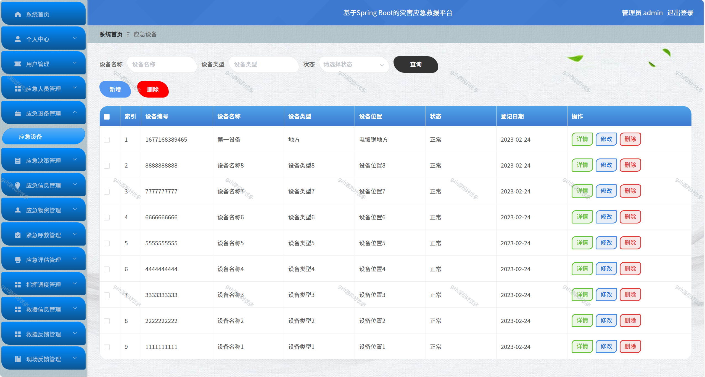
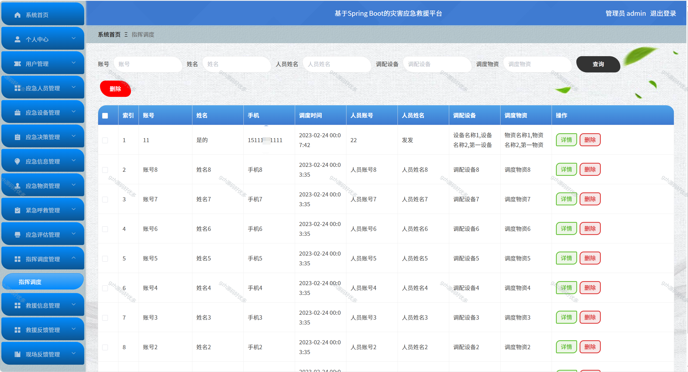

# springbootA337
springbootA337灾害应急救援平台+LW+PPT
 
## 查看主页获取源码 

### 一、关键词

灾害应急救援系统，灾害应急综合平台，应急救援操作平台

### 二、作品包含

源码+数据库+万字设计文档+PPT+全套环境和工具资源+本地部署教程

### 三、项目技术

前端技术：Html、Css、Js、Vue2.0、Element-ui 
后端技术：Java、SpringBoot2.0、MyBatis

  
### 四、运行环境（以下版本亲测，其他版本未知，请自测）

开发工具：IDEA/eclipse  + VSCODE

数据库：MySQL5.7（最低要5.7版本）

数据库管理工具：Navicat10以上版本

环境配置软件： JDK1.8 + Maven3.6.3

前端Nodejs：14

浏览器：谷歌浏览器

### 五、项目介绍

项目编号：springbootA337

应急救援平台的设计可以比其他系统更为出色的能力，可以更高效的完成最新的用户、应急人员、应急设备、应急决策、应急信息、应急物资、紧急呼救、应急评估、指挥调度、救援信息、救援反馈、现场反馈等功能。
此系统设计主要采用的是JAVA语言来进行开发，采用SpringBoot框架技术，框架分为三层，分别是控制层Controller，业务处理层Service，持久层dao，能够采用多层次管理开发，对于各个模块设计制作有一定的安全性；数据库方面主要采用的是MySQL来进行开发，其特点是稳定性好，数据库存储容量大，处理能力快等优势；服务器采用的是Tomcat服务，能够提供稳固的运行平台，确保系统稳定运行。通过灾害应急救援平台来提升本课题的各项功能的工作效率，提供了一个多样功能，具有良好实用性的灾害应急救援平台。 

### 六、运行截图

